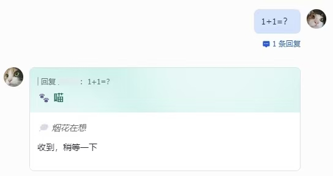
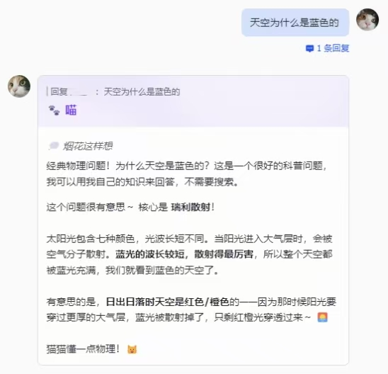
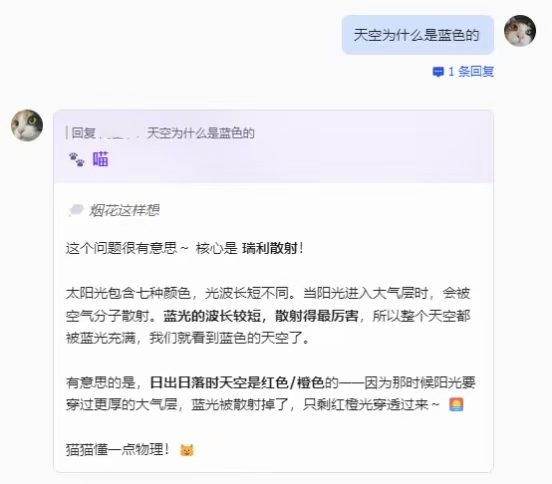

<a href="./README.md">简体中文</a> | English

# OpenClaw Feishu Reasoning UX

Make OpenClaw show reasoning in Feishu in a Telegram-like real-time streaming way, avoid long black-box waits, and pair it with better-looking colorful 2.0 cards that support multi-component containers and rich text.

This is a skill for OpenClaw, designed to improve or debug the Feishu reply experience, especially around:

- visible reasoning / reply dual lanes
- collapsible reasoning panels
- card 2.0 layouts
- unified titles, colors, and templates
- model capability detection and troubleshooting

## Preconditions and risk points

Before asking an agent to modify anything, clarify these first:

- confirm that the user is on **OpenClaw's built-in Feishu channel**
- do not treat that as equivalent to **Feishu's official plugin** or other Feishu integrations
- confirm the current model/provider path, especially:
  - `minimax-cn`
  - not `minimax-portal`
- if raw reasoning is involved, do not jump straight into runtime changes
  - first do low-risk title/color/card 2.0 container changes
  - then confirm ordinary answer streaming is stable
  - only then move into the higher-risk raw reasoning path

The proven reference case behind this skill is:

- OpenClaw running inside WSL
- OpenClaw's built-in Feishu channel
- `minimax-cn/MiniMax-M2.7`

If the user's setup differs from that path, the agent should say so explicitly before proceeding.

## Screenshots

### Initial thinking state

### Expanded reasoning content

### Collapsed reasoning with final reply

## What this is

A skill for improving OpenClaw's Feishu-channel reply experience.

Its goal is to:

- first confirm whether this is really the built-in OpenClaw Feishu channel rather than another Feishu plugin/integration
- first detect whether the current model path truly supports visible raw reasoning
- if yes, wire the real reasoning stream into Feishu cards
- if not, explain the limitation clearly and still improve the reply-card UX

## How this differs from ordinary Feishu streaming

OpenClaw's built-in Feishu channel, as well as the ordinary official Feishu-side streaming behavior, usually only stream the final reply text. They do not stream the model's reasoning in real time.

This skill aims to:

- display reasoning and answer separately
- place reasoning inside a collapsible panel
- continue streaming the answer in a dedicated answer area

That makes it much closer to a Telegram-style reasoning-stream experience than a single updating body block.

## Default preset flow

The default preset works like this:

1. send a card first
2. show a placeholder inside the reasoning panel
3. stream raw reasoning into the collapsible panel in real time
4. collapse the reasoning panel when the final answer starts streaming
5. continue streaming the final answer in the answer lane

## This is not fake reasoning

This skill does not default to template text pretending to be reasoning.

It first checks:

- whether the current model/provider/runtime truly exposes live reasoning

Then it decides:

- whether raw reasoning can be shown
- or whether only ordinary answer streaming and card UX improvements are possible

## Who this is for

Use this if you:

- use OpenClaw with Feishu
- want a more visible reply process
- want better card 2.0 layouts, collapsible panels, titles, and colors
- have seen issues like `Thinking...`, missing raw reasoning, or title/style regressions

## Installation

Recommended path:

- give this GitHub repository URL directly to OpenClaw
- let it read the repository as a skill source

Repository URL:

- `https://github.com/doashoi/openclaw-feishu-reasoning-ux`

## Minimal trigger examples

- `Help me make OpenClaw replies in Feishu feel more layered`
- `Why does Feishu only show Thinking... now?`
- `I want visible reasoning and better-looking Feishu cards`
- `Help me unify the title, colors, and collapsible reasoning panel`

## FAQ

### Why is raw reasoning sometimes Chinese and sometimes English?

That is a common outcome and does not automatically mean the card implementation is broken.

The reason is usually model/provider-side:

- the model may internally reason in mixed Chinese and English
- the runtime may pass upstream reasoning snapshots through to the UI with minimal transformation
- different prompts may result in different reasoning languages

If what is shown is truly raw reasoning, language consistency is not guaranteed.

### Why do some models stream raw reasoning while others only show Thinking...?

Because different models/providers expose reasoning in different forms.

Common cases:

- readable live reasoning events
- thinking only in the final transcript
- encrypted/opaque reasoning payloads
- no exposed reasoning at all

So this is not only a Feishu card-layer issue. It also depends on the current model path itself.

One important nuance:

- some model paths are not "completely unsupported"
- they may only support snapshot/transcript-only thinking
- in those cases, the model can still preserve reasoning after completion, but it cannot provide true live raw reasoning

So the more accurate statement is often:
- `does not support true live raw reasoning on the current path`
rather than simply:
- `the model does not support reasoning`

### Can everything be forced into Chinese?

You can add a presentation-layer rewrite, but then it stops being strictly raw reasoning.

By default, this skill prioritizes preserving the authenticity of reasoning rather than silently translating or rewriting it.

## References

### Official Feishu docs

- Feishu Card JSON 2.0 structure  
  https://open.feishu.cn/document/feishu-cards/card-json-v2-structure
- `collapsible_panel`  
  https://open.feishu.cn/document/feishu-cards/card-json-v2-components/containers/collapsible-panel
- Feishu card update guide  
  https://open.feishu.cn/document/feishu-cards/update-feishu-card
- PATCH updates for sent message cards  
  https://open.feishu.cn/document/server-docs/im-v1/message-card/patch

### OpenClaw / Telegram references

- OpenClaw Telegram channel docs  
  https://openclawlab.com/en/docs/channels/telegram/
- OpenClaw upstream repository  
  https://github.com/openclaw/openclaw

### Repository-local references

- [SKILL.md](./SKILL.md)
- [references/implementation-guide.md](./references/implementation-guide.md)
